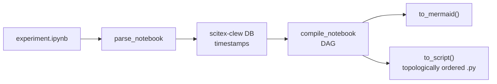

# SciTeX Notebook (`scitex-notebook`)

<p align="center">
  <a href="https://scitex.ai">
    
  </a>
</p>

<p align="center"><b>Jupyter notebook verification, compilation, and DAG-based conversion to topologically-ordered Python scripts.</b></p>

<p align="center">
  <a href="https://scitex-notebook.readthedocs.io/">Full Documentation</a> · <code>uv pip install scitex-notebook[all]</code>
</p>

<!-- scitex-badges:start -->
<p align="center">
  <a href="https://pypi.org/project/scitex-notebook/"></a>
  <a href="https://pypi.org/project/scitex-notebook/"></a>
  <a href="https://github.com/ywatanabe1989/scitex-notebook/actions/workflows/test.yml"></a>
  <a href="https://codecov.io/gh/ywatanabe1989/scitex-notebook"></a>
  <a href="https://scitex-notebook.readthedocs.io/en/latest/"></a>
  <a href="https://www.gnu.org/licenses/agpl-3.0"></a>
</p>
<!-- scitex-badges:end -->

---

## Problem and Solution

| # | Problem | Solution |
|---|---------|----------|
| 1 | **Cell order lies** — on-disk `.ipynb` cell sequence has no relationship to execution order, so naive `jupyter nbconvert` produces scripts that don't run | **DAG from timestamps** — reconstructs the true execution dependency graph from `scitex-clew` session timestamps, then emits a topologically-ordered `.py` or a Mermaid diagram |
| 2 | **Silent untracked I/O** — `scitex.io.save/load` calls outside `@stx.session` leave no reproducibility trail, but nothing warns you | **`check_notebook()`** — scans for untracked I/O and flags cells that bypass session tracking |
| 3 | **Exploration vs. production gap** — notebooks let you iterate freely, but shipping means rewriting by hand into a clean script | **"Do what you want, organize later"** — execute cells in any order while exploring; `compile_notebook(...).to_script()` emits the production-ready DAG-ordered script |

## Installation

Requires Python >= 3.10.

```bash
pip install scitex-notebook
```

Optional extras:

```bash
pip install "scitex-notebook[mcp]"     # MCP server for AI agents
pip install "scitex-notebook[linter]"  # IO-call conversion via scitex-linter
pip install "scitex-notebook[all]"     # everything
```

## Four Interfaces

<details>
<summary><strong>Python API</strong></summary>

```python
import scitex_notebook

cells    = scitex_notebook.parse_notebook("experiment.ipynb")
issues   = scitex_notebook.check("experiment.ipynb")         # untracked IO
results  = scitex_notebook.verify("experiment.ipynb")        # via clew DB
compiled = scitex_notebook.compile("experiment.ipynb")

print(compiled.to_mermaid())   # Mermaid DAG diagram
print(compiled.to_script())    # DAG-ordered Python script

scitex_notebook.convert(
    "experiment.ipynb",
    output="experiment.py",
    mode="unified",            # or "per_cell"
)
```

</details>

<details>
<summary><strong>CLI</strong></summary>

```bash
scitex-notebook verify-notebook experiment.ipynb
scitex-notebook check-notebook experiment.ipynb
scitex-notebook compile-notebook experiment.ipynb --format mermaid
scitex-notebook compile-notebook experiment.ipynb --format script -o experiment.py
scitex-notebook convert-notebook experiment.ipynb --mode unified -o experiment.py
scitex-notebook --help-recursive               # all commands + flags
scitex-notebook --json verify-notebook exp.ipynb  # structured output
```

</details>

<details>
<summary><strong>MCP Server — for AI Agents</strong></summary>

| Tool | Description |
|------|-------------|
| `notebook_verify`  | Verify clew sessions for a notebook |
| `notebook_check`   | Flag untracked `scitex.io` calls |
| `notebook_compile` | Return Mermaid DAG / script / JSON |
| `notebook_convert` | Convert `.ipynb` to `.py` |
| `notebook_parse_notebook` | Parse `.ipynb` and return all cells |
| `notebook_get_code_cells` | Return only code cells |
| `notebook_get_notebook_name` | Return notebook stem name |
| `notebook_skills_list` | List bundled skill pages |
| `notebook_skills_get` | Return a named skill page body |

```bash
scitex-notebook mcp start                      # start stdio server
scitex-notebook mcp list-tools                 # list available tools
scitex-notebook mcp doctor                     # verify MCP dependencies
```

</details>

## Python API

```python
from scitex_notebook import (
    parse_notebook, get_code_cells, get_notebook_name,
    compile, convert, verify, check,
)

cells = parse_notebook("experiment.ipynb")
compiled = compile("experiment.ipynb")
print(compiled.to_mermaid())   # Mermaid DAG
print(compiled.to_script())    # Topologically-ordered .py

results = verify("experiment.ipynb")
issues = check("experiment.ipynb")
```

## CLI

```bash
scitex-notebook compile-notebook experiment.ipynb   # DAG-ordered .py (--format script)
scitex-notebook convert-notebook experiment.ipynb   # .ipynb → @stx.session script
scitex-notebook verify-notebook experiment.ipynb    # clew session pass/fail
scitex-notebook check-notebook experiment.ipynb     # untracked-IO scan
scitex-notebook list-python-apis -vv                # public APIs with signatures
scitex-notebook skills list                         # bundled skill pages
scitex-notebook --help-recursive                    # full CLI reference
```

## IPython Magic Extension

```python
%load_ext scitex_notebook   # one line at the top of any notebook
```

Once loaded, every executed cell is analysed at runtime:
- **Hidden-state leak detection** — warns when a cell reads a name not defined by any earlier cell in this run
- **Out-of-order execution check** — flags non-monotonic `execution_count`
- **Untracked I/O** — every `stx.io.save/load` call is recorded per-cell

Cell metadata (dependencies, warnings, file hashes) is written to the same
Clew SQLite database used by `@scitex.session` and `stx.io`.

```bash
%load_ext scitex_notebook
%unload_ext scitex_notebook
```

## Architecture

```
scitex_notebook/
├── __init__.py           ← public API: parse, compile, convert, verify, check
├── __main__.py           ← `python -m scitex_notebook` entry
├── _parse.py             ← `parse_notebook`, `get_code_cells`, `get_notebook_name`
├── _verify.py            ← `verify_notebook` (clew session lookups), `check_notebook`
├── _compile.py           ← `compile_notebook`, `CompiledNotebook`, DAG construction
├── _convert.py           ← `convert_notebook`: .ipynb → @stx.session .py
├── _magic.py             ← IPython extension (%load_ext scitex_notebook)
├── _mcp_server.py        ← FastMCP server: 9 notebook_* tools
├── _cli/                 ← Click CLI
│   ├── _main.py          ←   verify-notebook, check-notebook, compile-notebook,
│   │                         convert-notebook, mcp, list-python-apis, skills
│   └── _skills.py        ←   `skills list|get|install`
└── _skills/
    └── scitex-notebook/  ← bundled agent-facing skill pages
```

## Demo



Out-of-order cells in the notebook are re-ordered into a runnable script:

```bash
$ scitex-notebook compile-notebook experiment.ipynb --format script -o experiment.py
$ python experiment.py     # runs cleanly, every time
```

## Dependencies

- **Required**: [`scitex-clew`](https://github.com/ywatanabe1989/scitex-clew) — execution-order reconstruction via timestamped sessions.
- **Optional**: [`scitex-linter`](https://github.com/ywatanabe1989/scitex-linter) — advanced IO-call rewriting during conversion.

## Part of SciTeX

`scitex-notebook` is part of [**SciTeX**](https://scitex.ai). Install via
the umbrella with `pip install scitex[notebook]` to use as
`scitex.notebook` (Python) or `scitex notebook ...` (CLI).

The SciTeX system follows the Four Freedoms for Research below, inspired by [the Free Software Definition](https://www.gnu.org/philosophy/free-sw.en.html):

>Four Freedoms for Research
>
>0. The freedom to **run** your research anywhere — your machine, your terms.
>1. The freedom to **study** how every step works — from raw data to final manuscript.
>2. The freedom to **redistribute** your workflows, not just your papers.
>3. The freedom to **modify** any module and share improvements with the community.
>
>AGPL-3.0 — because we believe research infrastructure deserves the same freedoms as the software it runs on.

---

<p align="center">
  <a href="https://scitex.ai" target="_blank"></a>
</p>

<!-- EOF -->
